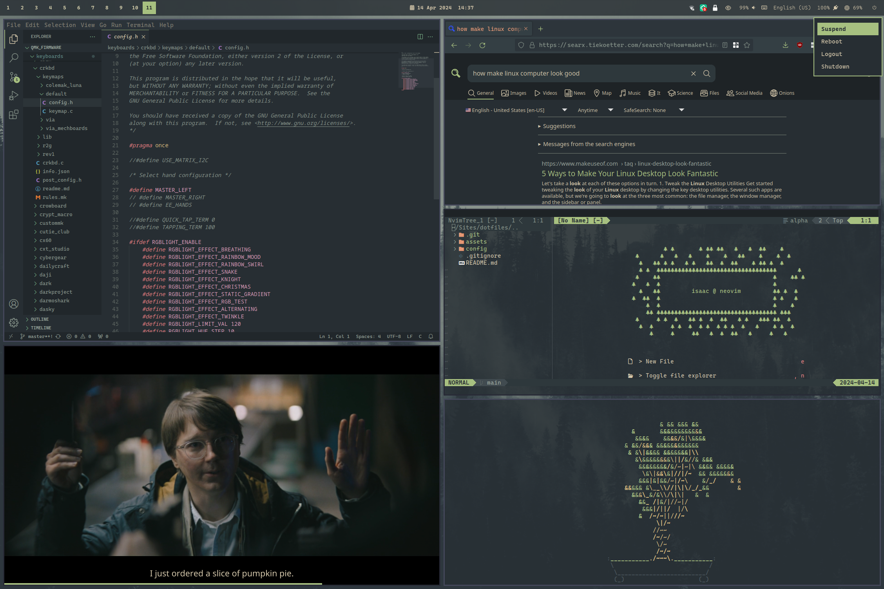

# Isaac's dotfiles

  

Some of my customized configuration files for my Linux laptop, including the theme I have applied to my preferred window manager ([sway](https://github.com/swaywm/sway) with waybar, wofi, etc) and a couple of applications (e.g., [neovim](https://github.com/neovim/neovim), [alacritty](https://github.com/alacritty/alacritty), [mpv](https://github.com/mpv-player/mpv)). I [contribute ports](https://github.com/sainnhe/everforest/wiki) to the [Everforest](https://github.com/sainnhe/everforest/) color scheme and also apply those colors to my desktop, with some modifications.
